  

  
  
  
  

## About

I design and build full-stack applications with a growing focus on AI. I care about clean code, solid UX and systems that stay simple as they scale.

- 🔭 **Building:** RESTful APIs · Responsive web apps · AI-powered features
- 🌱 **Learning:** Machine Learning · System Design · Web3
- 📍 **Based in:** Naogaon, Bangladesh
- 📫 **Reach me:** [raihanrifat0xdev@gmail.com](mailto:raihanrifat0xdev@gmail.com)
- ⚡ **Fun fact:** Started coding on Termux with just a phone 📱

## Tech stack

<b>Languages &amp; Frameworks</b> 
<picture>
  <source media="(prefers-color-scheme: dark)" srcset="https://skillicons.dev/icons?i=js,ts,python,html,css,tailwind,react,nextjs,vite,nodejs,express&perline=11&theme=dark">
  
</picture>
  
<b>Databases &amp; Backend</b> 
<picture>
  <source media="(prefers-color-scheme: dark)" srcset="https://skillicons.dev/icons?i=mongodb,postgresql,prisma,graphql,firebase,redis&perline=6&theme=dark">
  
</picture>
  
<b>Tools &amp; DevOps</b> 
<picture>
  <source media="(prefers-color-scheme: dark)" srcset="https://skillicons.dev/icons?i=docker,git,github,linux,vscode,vercel,heroku,aws&perline=8&theme=dark">
  
</picture>
  
<b>Mobile &amp; Design</b> 
<picture>
  <source media="(prefers-color-scheme: dark)" srcset="https://skillicons.dev/icons?i=flutter,figma,postman&perline=3&theme=dark">
  
</picture>

## Featured projects

| Project | Description | Stack | ★ | Links |
| :-- | :-- | :-- | --: | :-- |
| **[Streamverse](https://github.com/raihan-rifat007/Streamverse)** | Streamverse — free open-source IPTV web player to browse and watch global live channels i… | TypeScript • iptv • open-source • streaming | 0 |   |
| **[GeminiAPI](https://github.com/raihan-rifat007/GeminiAPI)** | GeminiAPI — Flask API for AI image generation powered by Google Gemini with simple reques… | HTML • ai • flask • gemini | 1 |  |
| **[Pinterest-Scraper](https://github.com/raihan-rifat007/Pinterest-Scraper)** | Pinterest Scraper — production web UI to search, scrape boards, export metadata, and down… | Python • export • fastapi • pinterest | 0 |   |
| **[ScreenshotAPI](https://github.com/raihan-rifat007/ScreenshotAPI)** | ScreenshotAPI — self-hosted screenshot and PDF capture service using a headless browser p… | JavaScript • api • nodejs • pdf | 0 |  |
| **[YouTubeMusicAPI](https://github.com/raihan-rifat007/YouTubeMusicAPI)** | YouTubeMusicAPI — Deno TypeScript REST API for YouTube Music search and track metadata. | HTML • api • deno • music | 0 |   |
| **[RealHuman](https://github.com/raihan-rifat007/RealHuman)** | Pippo — Telegram AI chatbot using Bot API with English and Banglish personality support. | Python • ai • bot-api • chatbot | 0 |  |

<a href="https://github.com/raihan-rifat007?tab=repositories"><b>All repositories →</b></a>

## GitHub in numbers

<picture>
  <source media="(prefers-color-scheme: dark)" srcset="assets/stats-dark.svg">
  
</picture>
<picture>
  <source media="(prefers-color-scheme: dark)" srcset="assets/languages-dark.svg">
  
</picture>

<picture>
  <source media="(prefers-color-scheme: dark)" srcset="assets/activity-dark.svg">
  
</picture>

<picture>
  <source media="(prefers-color-scheme: dark)" srcset="https://raw.githubusercontent.com/raihan-rifat007/raihan-rifat007/output/snake-dark.svg">
  
</picture>

## Recent activity

- ⭐ Starred [tas33n/File-Sharing-Bot](https://github.com/tas33n/File-Sharing-Bot) · `2026-10-07`
- ⭐ Starred [tas33n/ads-remover-bot](https://github.com/tas33n/ads-remover-bot) · `2026-10-07`
- ⭐ Starred [tas33n/fb-login-bot](https://github.com/tas33n/fb-login-bot) · `2026-10-07`
- ⭐ Starred [lagadev/Bkash-Recipe-](https://github.com/lagadev/Bkash-Recipe-) · `2026-10-07`
- ⭐ Starred [nafiz1000x/Fake-Bkash-Nagat-Screenshot-](https://github.com/nafiz1000x/Fake-Bkash-Nagat-Screenshot-) · `2026-10-07`
- ⭐ Starred [temsor-admin/fauxpost](https://github.com/temsor-admin/fauxpost) · `2026-10-07`

<b>Journey</b>

 

| Year | Milestone |
| :-- | :-- |
| **2024** | Started programming with HTML, CSS and JavaScript. |
| **2025** | Dived into React and Tailwind CSS and built the first interactive apps. |
| **2026** | Full-stack focus with Next.js, TypeScript and databases. |

## Connect

Open to collaborations, freelance work and open source. If you have an idea, let&apos;s talk.

  
  
  
  
  
  

---

  Rebuilt automatically every 6 hours by GitHub Actions · <a href="docs/AUTOMATION.md">how it works</a>
   
  

