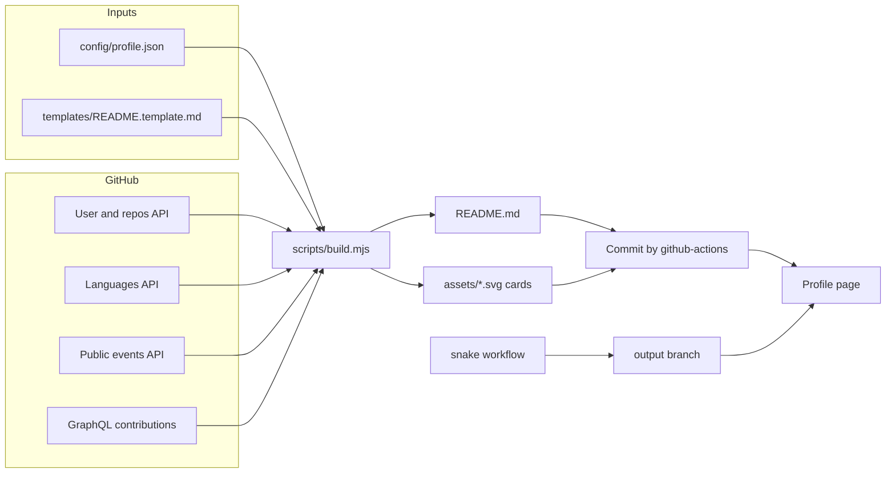

# Profile automation guide

How the self-updating profile in this repository works, how to configure it, and how to extend it.

- [Overview](#overview)
- [What is automated](#what-is-automated)
- [Repository layout](#repository-layout)
- [Setup](#setup)
- [Configuration reference](#configuration-reference)
- [Controlling the project showcase](#controlling-the-project-showcase)
- [Generated assets](#generated-assets)
- [Workflows](#workflows)
- [Secrets](#secrets)
- [Local development](#local-development)
- [Failure behavior](#failure-behavior)
- [Extending the template](#extending-the-template)
- [Troubleshooting](#troubleshooting)
- [Changes from the previous version](#changes-from-the-previous-version)
- [Ideas for further upgrades](#ideas-for-further-upgrades)

---

## Overview

`README.md` is **generated**. Do not edit it by hand, your changes will be overwritten on the next run. Edit the inputs instead:

| You want to change | Edit |
| --- | --- |
| Name, bio, roles, links, tech stack, journey, project rules | `config/profile.json` |
| Section order, headings, static text | `templates/README.template.md` |
| Look of the generated cards | `scripts/lib/svg.mjs` and `scripts/lib/colors.mjs` |



The generator has **zero npm dependencies**. It uses the `fetch` built into Node 20 and newer, so there is nothing to install and nothing to audit.

---

## What is automated

| Section | Source | Refresh |
| --- | --- | --- |
| Header banner with cycling roles | `config/profile.json` | On every config change |
| Followers badge | shields.io (live) | Live |
| Featured projects table | Public repositories, ranked and filtered | Every 6 hours |
| Overview card (repositories, stars, forks, followers, contributions, pull requests) | REST and GraphQL APIs | Every 6 hours |
| Top languages card | Languages API across your latest non-fork repositories | Every 6 hours |
| Contribution activity card (totals, current and longest streak, monthly chart) | GraphQL contribution calendar | Every 6 hours |
| Recent activity list | Public events API, merged and filtered | Every 6 hours |
| Contribution snake | `Platane/snk` | Daily |
| Tech stack icons | skillicons.dev | Static, driven by config |

All cards ship in **dark and light** variants and switch with the viewer's GitHub theme through `<picture>`.

---

## Repository layout

```text
raihan-rifat007/
├── .github
│   ├── workflows
│   │   ├── ci.yml
│   │   ├── snake.yml
│   │   └── update-profile.yml
│   ├── dependabot.yml
│   └── FUNDING.yml
├── assets
│   ├── activity-dark.svg
│   ├── activity-light.svg
│   ├── header.svg
│   ├── languages-dark.svg
│   ├── languages-light.svg
│   ├── stats-dark.svg
│   └── stats-light.svg
├── config
│   └── profile.json
├── docs
├── scripts
│   ├── lib
│   │   ├── async.mjs
│   │   ├── colors.mjs
│   │   ├── config.mjs
│   │   ├── events.mjs
│   │   ├── format.mjs
│   │   ├── github.mjs
│   │   ├── projects.mjs
│   │   ├── render.mjs
│   │   ├── stats.mjs
│   │   └── svg.mjs
│   └── build.mjs
├── templates
│   └── README.template.md
├── test
│   ├── build.test.mjs
│   ├── events.test.mjs
│   ├── helpers.mjs
│   ├── projects.test.mjs
│   ├── render.test.mjs
│   ├── stats.test.mjs
│   └── svg.test.mjs
├── .gitignore
├── package.json
└── README.md
```

---

## Setup

1. The repository must be named exactly like the account (`raihan-rifat007/raihan-rifat007`) and be public.
2. Push this code to the default branch (`main`).
3. Open **Actions** and enable workflows if GitHub asks.
4. Pushing changes under `config/`, `templates/` or `scripts/` starts **Update profile** automatically. You can also run it from **Actions**, **Update profile**, **Run workflow**.
5. Run **Contribution snake** once so the `output` branch exists.
6. Optional: add a `PROFILE_TOKEN` secret (see [Secrets](#secrets)).

Until the first run finishes, the README shows placeholder cards. The first run replaces them with real data.

---

## Configuration reference

All keys live in `config/profile.json`. The file is validated on every run and in CI, and errors are listed one per line.

| Key | Type | Description |
| --- | --- | --- |
| `username` | string | GitHub account to read |
| `name` | string | Display name used in the header |
| `alias` | string | Short handle |
| `headline` | string | Alt text and summary role |
| `tagline` | string | Line under the roles in the header |
| `roles` | string[] | Roles cycled in the header (a single entry disables the animation) |
| `location` | string | Used in the badge and the About list |
| `email` | string | Used in the About list and the Connect badges |
| `website` | string | Portfolio URL used in the badge row |
| `status` | string | Text of the green status badge |
| `accent` | `#rrggbb` | Header gradient base color |
| `about` | string | Intro paragraph |
| `now.building`, `now.learning` | string[] | Bullet content in About |
| `funFact` | string | Last bullet in About |
| `cta` | string | Sentence above the Connect badges |
| `stack` | object[] | Groups of [skillicons.dev](https://skillicons.dev) ids with `group`, `icons`, `perline` |
| `journey` | object[] | Rows of the collapsible Journey table (`year`, `text`) |
| `socials` | object[] | Connect badges: `label`, `url`, `color`, `logo`, optional `logoColor` |
| `projects.max` | number | Maximum rows in the table |
| `projects.pin` | string[] | Repository names forced to the top, in this order |
| `projects.exclude` | string[] | Repository names never shown |
| `projects.featuredTopic` | string | Topic that promotes a repository after the pinned ones |
| `projects.excludeTopic` | string | Topic that hides a repository everywhere, including language stats |
| `projects.includeForks` | boolean | Show forks |
| `projects.includeArchived` | boolean | Show archived repositories |
| `projects.fallback` | object[] | Rows used by `npm run preview` and the first offline build |
| `activity.max` | number | Maximum items in Recent activity |
| `snake` | boolean | Show or hide the snake section |
| `languages.top` | number | Languages shown before the rest is grouped as Other |
| `languages.sampleRepos` | number | Number of latest repositories sampled for language bytes |

---

## Controlling the project showcase

You do not edit the README to add a project. Manage it from GitHub itself:

| Goal | How |
| --- | --- |
| Add a project | Make the repository public. It appears on the next run |
| Show a live link | Set the repository **Website** field. A Live badge is added |
| Change the description | Edit the repository **About** description |
| Change the stack column | The primary language plus up to three repository topics |
| Promote a repository | Add the `featured` topic |
| Pin an exact order | Add the repository name to `projects.pin` |
| Hide a repository | Add the `no-showcase` topic or list it in `projects.exclude` |

Ranking order: pinned (in list order), then `featured` topic, then stars, then most recent push. The profile repository itself is always skipped.

---

## Generated assets

| File | Content |
| --- | --- |
| `assets/header.svg` | Animated banner (gradient, grid, drifting glow, cycling roles) |
| `assets/stats-{dark,light}.svg` | Six-metric overview card |
| `assets/languages-{dark,light}.svg` | Stacked bar and legend |
| `assets/activity-{dark,light}.svg` | Totals, streaks and twelve-month bar chart |

Every card includes a `<title>` and `<desc>`, and the README image alt text carries the live numbers, so the profile stays readable with screen readers.

Cards contain no timestamps. A run that finds identical data produces identical files, so no commit is made and the history stays clean.

---

## Workflows

| Workflow | Trigger | Purpose |
| --- | --- | --- |
| `update-profile.yml` | Every 6 hours, manual, pushes touching `config/`, `templates/` or `scripts/` | Runs the tests, rebuilds README and cards, commits only when something changed |
| `snake.yml` | Daily, manual, changes to the workflow | Renders the snake in light and dark and publishes it to the `output` branch |
| `ci.yml` | Pull requests and relevant pushes | Validates config and template, runs tests, renders an offline preview |
| `dependabot.yml` | Monthly | Keeps GitHub Action versions current |

Design notes:

- Commits made with `GITHUB_TOKEN` never trigger other workflows, so the update cannot loop.
- `concurrency` serializes runs and the push step rebases first, so overlapping triggers cannot conflict.
- The commit message carries `[skip ci]`.
- GitHub pauses scheduled workflows after 60 days without repository activity. If that happens, open **Actions** and re-enable them.

---

## Secrets

| Secret | Required | Purpose |
| --- | --- | --- |
| `GITHUB_TOKEN` | Provided automatically | Reads public data with a high rate limit |
| `PROFILE_TOKEN` | No | A fine-grained or classic personal access token. Use it only if you want private contributions counted. Enable **Private contributions** in your GitHub profile settings and give the token `read:user` |

Never commit tokens. The scripts read them from the environment only.

---

## Local development

Requirements: Node.js 20 or newer. There is nothing to install.

| Command | What it does |
| --- | --- |
| `npm run preview` | Offline build with placeholder cards and the fallback projects. No network, no token |
| `npm run build` | Full online build. Set `GITHUB_TOKEN` to avoid low anonymous rate limits |
| `npm run check` | Validates `config/profile.json` and the template tokens without writing |
| `npm test` | Runs the full test suite |

```bash
GITHUB_TOKEN=ghp_xxx npm run build
```

Open `README.md` in an editor with Markdown preview. Cards render from `assets/`.

---

## Failure behavior

The build is built to degrade gracefully and to fail loudly only when it must:

| Problem | Result |
| --- | --- |
| User or repository list unavailable | Build fails (red run), nothing is overwritten |
| One repository languages call fails | That repository falls back to its primary language, the run continues |
| Public events unavailable | Recent activity shows a placeholder, the rest is built |
| Contribution calendar unavailable | Overview and activity cards keep their previous files, README is still rebuilt |
| Template uses an unknown token | Build fails with the token name |
| Invalid config | Build fails with one line per problem |
| Network blip (5xx, timeout) | Retried up to three times with exponential backoff |
| Rate limited (403, 429) | Fails fast, a later scheduled run recovers |

Warnings appear as annotations on the workflow run.

---

## Extending the template

Add a new section in four steps:

1. Write a `renderSomething(config, data)` function in `scripts/lib/render.mjs`.
2. Add its key to `TOKENS` and to the object returned by `buildValues`.
3. Place `{{something}}` in `templates/README.template.md`.
4. Add a test next to the existing ones in `test/render.test.mjs`, then run `npm test`.

To add a new card, create a renderer in `scripts/lib/svg.mjs`, return it from `renderCards`, and reference the file from a render function.

---

## Troubleshooting

| Symptom | Fix |
| --- | --- |
| Cards show dashes or "first automated run" | The first run has not finished. Run **Update profile** manually |
| Snake image is broken | Run **Contribution snake** once and confirm the `output` branch exists |
| Contribution numbers are lower than expected | Add a `PROFILE_TOKEN` and enable private contributions |
| A repository does not show up | It may be a fork, archived, private, listed in `exclude`, or tagged `no-showcase` |
| Push step fails with permission denied | Settings, Actions, General, Workflow permissions, set to read and write |
| Update workflow never runs | Check that Actions are enabled and not paused for inactivity |

---

## Changes from the previous version

### Bugs fixed

| Problem in the old setup | Fix |
| --- | --- |
| The repository list never updated: the script searched for `## Featured Projects`, but the real heading contained an `` tag, so the pattern never matched and every run did nothing | Template-based generation, no fragile regex on a hand-edited file |
| Even if it had matched, the pattern stopped at the first `###` heading and would have duplicated the table on every run | Whole README is rendered from a template |
| Snake workflow used `raihan_rifat007` (underscore). GitHub usernames cannot contain underscores | Uses `github.repository_owner` |
| Commit message was `Updateeeeeeeeeeeeee Repository's [skip ci]` | Conventional commit message |
| Python 3.9 and `actions/setup-python@v4` | Node 22, zero dependencies |
| API failure was swallowed silently, and pagination broke on the first error | Typed errors, retries, clear failures |
| Streak stats were served from a Heroku app, a platform that ended free hosting | Self-generated streak and activity card |
| Stats, language, activity and trophy cards came from third-party servers that rate-limit and go offline | Self-generated cards committed to the repository |
| Profile views counter and a dozen external GIFs slowed the page | Removed |
| Dead file `.github/raihan07.js` | Removed |

### Content decisions that need your review

- **Removed unverifiable claims.** The old README stated "100K+ active users", "50K+ daily requests", "500+ stars across 30+ projects", "90%+ test coverage" and "3+ years of React". These contradict the portfolio, which says programming started in 2024, and cannot be verified from GitHub. Visitors and recruiters check such numbers. Add figures back only if you can show them.
- **Journey timeline** now follows the dates on the portfolio (2024, 2025, 2026). The old README said 2021 to 2025.
- **Email** is kept as `raihan.rifat007@gmail.com` from the old README. The portfolio uses a different address. Pick one and set it in both places.
- **LinkedIn** uses `raihan-rifat007` (hyphen) from the old README. The portfolio used an underscore.

---

## Ideas for further upgrades

| Idea | Effort | Notes |
| --- | --- | --- |
| WakaTime coding hours card | Low | Add a `WAKATIME_API_KEY` secret, fetch weekly stats, render one more card |
| Latest blog or dev.to posts | Low | Add an RSS fetch and a `{{posts}}` token |
| Bangla version of the profile | Low | Second template and config, build writes `README.bn.md` |
| Pinned repository cards with live previews | Medium | Reuse the website screenshot approach from the portfolio |
| Weekly changelog commit summary | Medium | Summarize merged pull requests with the events data |
| Self-generated trophies | Medium | Compute badges from stars, streaks and repository counts |
| Sponsor and support section | Low | Already supported through `.github/FUNDING.yml` |
| Shared data with the portfolio | Medium | Publish `profile.json` once and read it from both projects |
